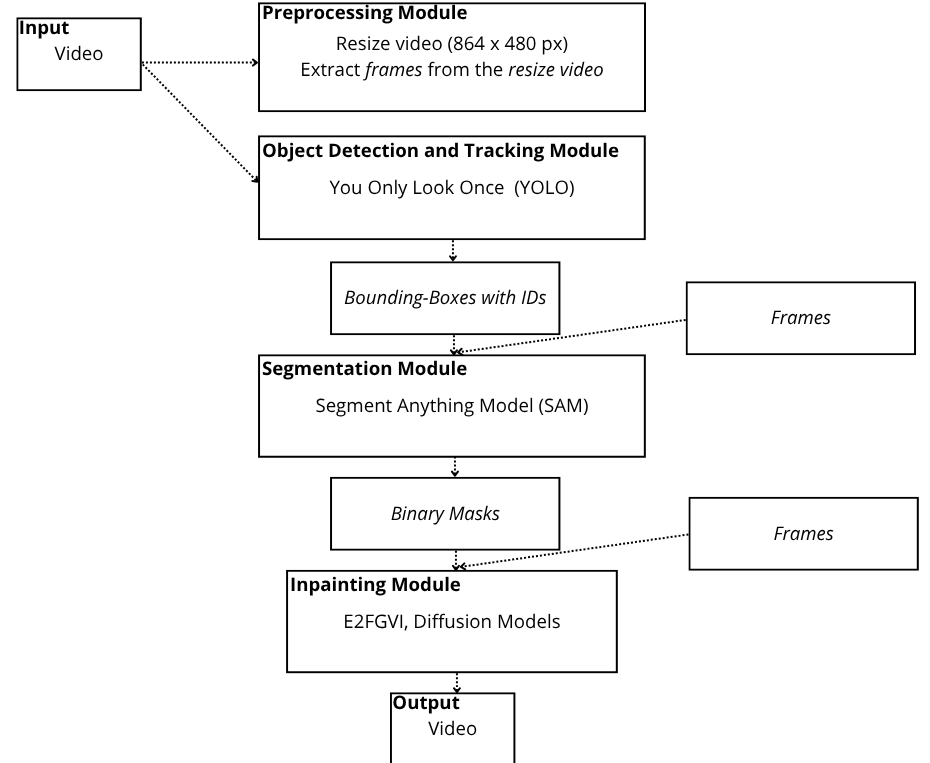

# 🎬 Video Inpainting Pipeline + Script to convert MOTchallenge format dataset to YOLO format

End-to-end pipeline for **video people removal** combining several AI models: 
<ul>
  <li>You Only Look Once (Yolo) + BoT-SORT (tracking</li>
  <li>Segment Anything Model (SAM)</li>
  <li><a href="https://github.com/MCG-NKU/E2FGVI">Towards An End-to-End Framework for Flow-Guided Video Inpainting (E2FGVI)</a></li>
</ul> 

## Pipeline Overview

## Dataset 
Most of my work was to create a proprer dataset with challenging videos. To do this, I combined the MOT17 and MOT20 datasets from the <a href="https://motchallenge.net/">Multiple Object Tracking Challenge (MOTChallenge)</a>
