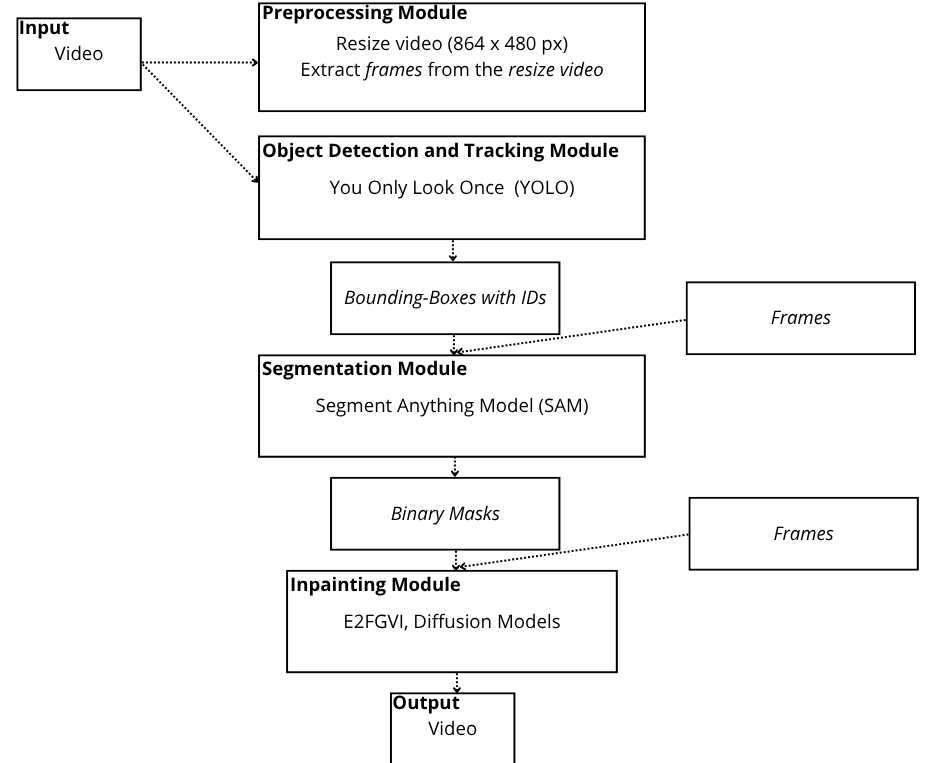
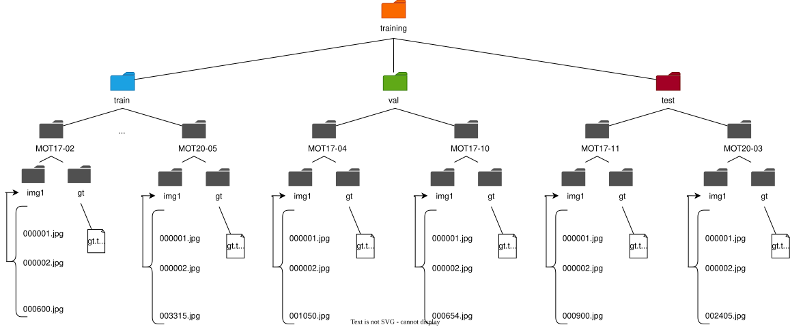

# 🎬 Video Inpainting Pipeline + MOT → YOLO Converter

## 🚀 End-to-End Pipeline for **Video People Removal**

This project implements a complete **video inpainting pipeline** to automatically remove people from videos.  
It combines **state-of-the-art models** in detection, segmentation and inpainting to achieve robust results on challenging videos (e.g. surveillance footage with multiple people).

---

## 🔍 Models & Pipeline

| Step                  | Model/Tool | Description |
|-----------------------|------------|-------------|
| **Detection + Tracking** | [YOLO](https://github.com/ultralytics/ultralytics) + BoT-SORT | Detect and track people across frames |
| **Segmentation**      | [Segment Anything Model (SAM)](https://segment-anything.com/) | Generate binary masks for the detected persons |
| **Video Inpainting**  | [E2FGVI](https://github.com/MCG-NKU/E2FGVI) | Remove masked objects while maintaining temporal consistency |

<p align="center">
  
</p>


---

## 🏗️ Project Context

This project was carried out during my **6-month internship** at the <a href="https://liu.se/en/organisation/liu/isy/cvl">Computer Vision Laboratory</a>, <a href="https://liu.se/en">Linköping University</a>.  
It allowed me to explore **Computer Vision** and **dataset engineering** in depth.  

📄 You can read more about the challenges and results in my [internship report](assets/internship_report.pdf).

---

## Setup installation 
1. Clone this repository to your local machine (or download the ZIP and extract it to any desired location):

   ```bash
   git clone https://github.com/MathisPicasse/YOLOV11_SAM2_E2FGVI.git
   cd YOLOV11_SAM2_E2FGVI
   ```

2. Install Python 

   #### Linux/Unix
   <details>
  
   We recommend using <a href="https://github.com/pyenv/pyenv">pyenv</a> to manage Python versions. This project uses **Python 3.10.13**:

   ```bash
   
   pyenv install 3.10.13
   ```
   </details>
  
   #### Windows
   <details>
   pyenv is not available natively. 
   <ul>Install Python 3.10.13 directly
   <li>Use <a href="https://github.com/pyenv-win/pyenv-win">pyenv-win</a></li>
   </ul>
   </details>
  

3. Create and Configure the Virtual Environment

   #### Linux/Unix
   <details>

    ```bash
   
    pyenv virtualenv 3.10.13 your_env_name
    ```

    Associate this environment with the project folder (auto-activated)
    
    ```bash
   
    pyenv local your_env_name
    ```
   </details>
  
   #### Windows
   <details>

    ```bash
   
    python -m venv .venv
    .\.venv\Scripts\Activate.bat
    ```
   </details>


4. Install Dependencies
   ```bash
   
    pip install --upgrade pip
    pip install -r requirements.txt
    ```
5. Download models 
   You can fin in the folder `02_weights/` on this [google drive](https://drive.google.com/drive/folders/1bgOJGK5JYptOmDVDqoLaYZq2qA8GkE5T?usp=drive_link) the differents models and weights for each module:

## 📂 Dataset Engineering

Most of the work focused on building a **robust dataset** to train YOLO for people detection on challenging videos.  

- Datasets used: [MOT17](https://motchallenge.net/data/MOT17/) + [MOT20](https://motchallenge.net/data/MOT20/) from the **MOTChallenge**.  
- Custom script to:
  - **Merge datasets**  
  - **Convert MOT format → YOLO format**  
The script allow to resize images, compute bounding boxes in the right formatn downsample the number of frames and saving this in some 
specigid folder to then train YOLO
This part in highly detailed in my [internship report](assets/internship_report.pdf)
👉 The script is available in [`scripts/convertToYolo.py`](scripts/convertToYolo.py).

### 🔧 How to use the script to convert MOT → YOLO

In the folder `configs/`, you will find the file **`MOT_TO_YOLO.json`** to define all parameters for converting the **MOT dataset → YOLO format**.  
Here is the configuration I used adapted to the dataset.

```json
{
    "PathToDataFolders": "/path/to/MOT/data/",
    "OutputDir": "/path/to/output/",
    "Classes": {
        "1": "person",
        "2": "person",
        "7": "person"
    },
    "ResizeImages": true,
    "TargetSize": [864,480],
    "train_folders": {
        "MOT17-02": [1920, 1080],
        "MOT17-05": [640, 480],
        "MOT17-09": [1920, 1080],
        "MOT17-13": [1920, 1080],
        "MOT20-01": [1920, 1080],
        "MOT20-02": [1920, 1080],
        "MOT20-05": [1654, 1080]
    },
    "val_folders": {
        "MOT17-04": [1920, 1080],
        "MOT17-10": [1920, 1080]
    },
    "test_folders": {
        "MOT17-11": [1920, 1080],
        "MOT20-03": [1173, 880]
    },
    "SubsampleRate": 7
}
```
🔑 Parameters Details  

- **PathToDataFolders**: Path to the main folder containing the raw MOT sequences. It corresponds to the folder **`training`** in the dataset structure below.
- **OutputDir**: Path to the output folder. For each sequence, two subfolders will be created:  
  - `img/` → resized frames  
  - `annotations/` → YOLO label files (one per frame).  
- **Classes**: Mapping between MOT class IDs and YOLO class names. In this example, IDs `1`, `2`, and `7` are all grouped under the class `person`.  
- **ResizeImages**: Boolean flag to enable or disable resizing of images.  
- **TargetSize**: Target resolution `[width, height]` for resizing.  
- **train_folders / val_folders / test_folders**: Sequences used for training, validation, and testing. The values `[W, H]` correspond to the original resolution of each video (important for annotation conversion).  
- **SubsampleRate**: Frame subsampling rate. For example, `7` means every 7th frame is kept (0, 7, 14, …).  


The combined MOT dataset must have the following structure:  

<p align="center">
  
</p>


### Dataset used to train YOLO 
training set:
| Name     | Resolution | Frames | Camera | Viewpoint | Conditions | Scene                  |
|----------|------------|--------|--------|-----------|------------|------------------------|
| MOT17-02 | 864×480    | 86     | static | medium    | cloudy     | large square           |
| MOT17-05 | 864×480    | 93     | moving | medium    | sunny      | street scene           |
| MOT17-09 | 864×480    | 75     | static | low       | indoor     | Main aisle in a mall   |
| MOT17-13 | 864×480    | 84     | moving | high      | sunny      | busy intersection      |
| MOT20-01 | 864×480    | 86     | static | high      | indoor     | train station          |
| MOT20-02 | 864×480    | 93     | static | high      | indoor     | train station          |
| MOT20-05 | 864×480    | 95     | static | high      | night      | square                 |
| **Total**|            | **612**|        |           |            |                        |

validation set:
| Name     | Resolution | Frames | Camera | Viewpoint | Conditions | Scene                  |
|----------|------------|--------|--------|-----------|------------|------------------------|
| MOT17-04 | 864×480    | 88     | static | high      | night      | pedestrian street      |
| MOT17-10 | 864×480    | 82     | moving | medium    | night      | pedestrian street      |
| **Total**|            | **170**|        |           |            |                        |

test set:
| Name     | Resolution | Frames | Camera | Viewpoint | Conditions | Scene                  |
|----------|------------|--------|--------|-----------|------------|------------------------|
| MOT17-11 | 864×480    | 90     | moving | medium    | indoor     | mall aisle             |
| MOT17-10 | 864×480    | 93     | static | high      | night      | stadium entrance       |
| **Total**|            | **141**|        |           |            |                        |


## 📊 Results
Results on test set
- Custom training of YOLO on MOT17+MOT20 significantly improved **mAP** on dense, multi-person videos.  

| Name                | Precision | Recall    | F1-score | mAP50     | mAP50-95   |
|---------------------|-----------|-----------|----------|-----------|------------|
| YOLO11 trained model| 0.884     | 0.770     | 0.823    | 0.853     | 0.442      |
| YOLO11              | 0.741     | 0.449     | 0.559    | 0.572     | 0.24       |  


